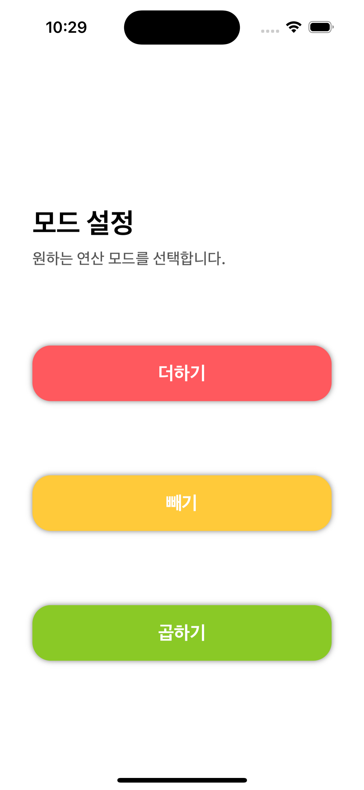
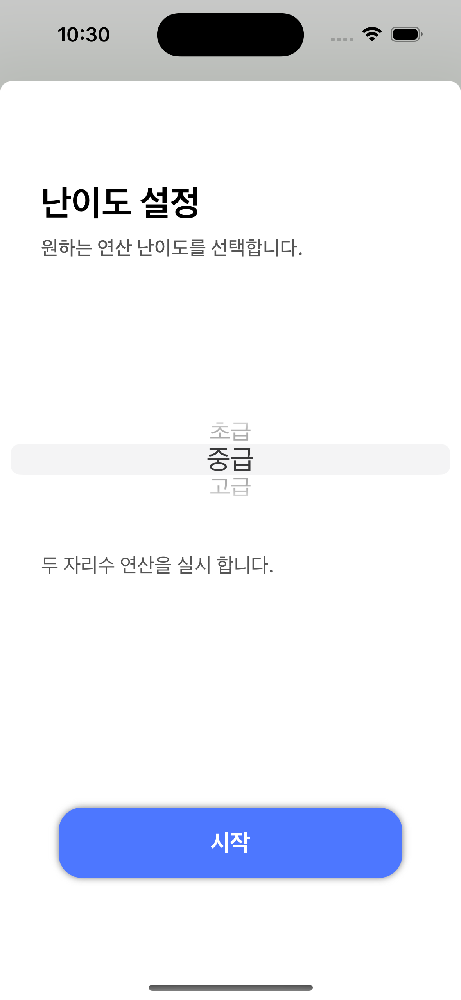
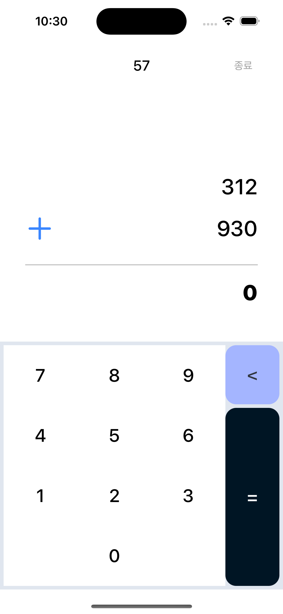
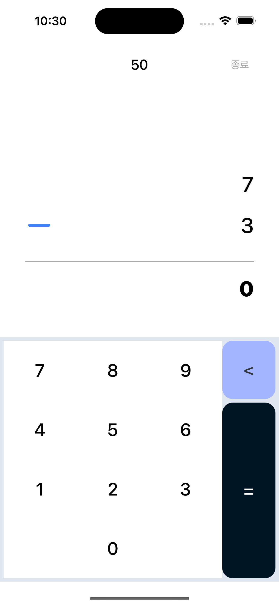
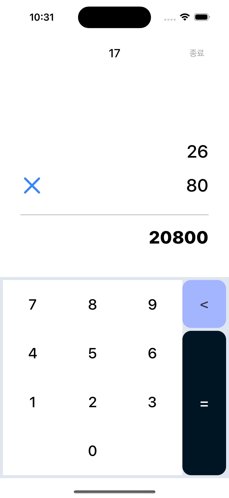
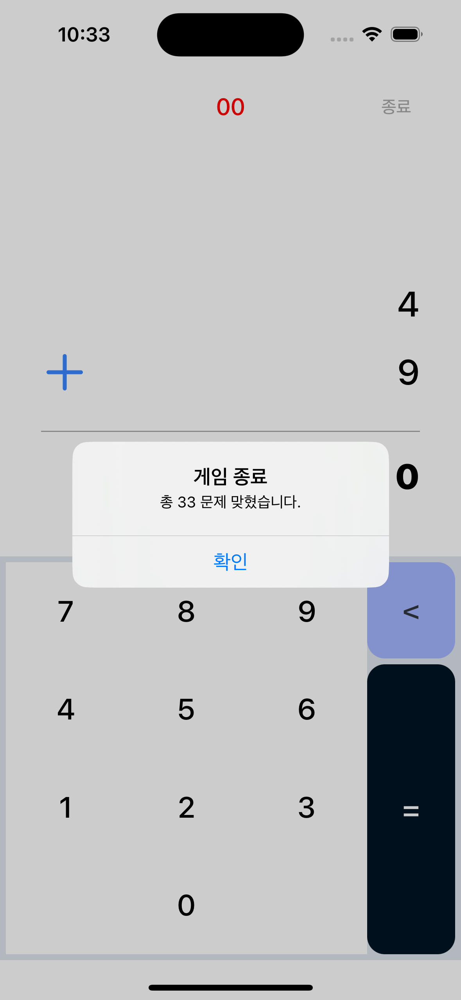

# Miracle Brain

미라클 브레인은 개인 토이 프로젝트로, 간편하고 재미있는 연산 게임을 통해 사용자들의 두뇌를 향상시키는 앱 서비스입니다. 사용자들은 원하는 연산과 난이도를 선택할 수 있으며, 선택한 옵션에 따라 문제가 제공됩니다. 60초의 제한 시간이 부여되며, 제한 시간 내 얼마나 정답을 맞혔는지 확인할 수 있습니다.

 

## 📌 프로젝트 소개

- 프로젝트명: Miracle Brain
- 기간: 2024. 03. 10 ~ 2023. 03. 10 (약 1일)
- 멤버: 신기범

 

## 🛠️ 기술 스택

- iOS, Swift, UIKit, StoryBoard, cocoaPods
- Lottie

 

## 💡 구현 기능

**1. 인트로 애니메이션 화면**

  
  

앱이 시작될 때, 사용자에게 더욱 생생한 환경을 제공하기 위해 Lottie 라이브러리를 활용하여 동적인 애니메이션 효과를 구현했습니다. 이를 통해 앱의 첫 화면에 사용자의 시선을 끌고 더욱 흥미롭게 만들었으며, LaunchScreen 대신에 활용되었습니다.

 

**2. 연산 옵션 설정**

  

더하기, 빼기, 곱하기와 같은 다양한 연산 옵션을 버튼 형태로 제공합니다. 사용자는 이 중에서 자신이 원하는 연산을 선택할 수 있습니다.

 

**3. 난이도 옵션 설정**

  

초급, 중급, 고급과 같은 다양한 난이도를 설정할 수 있습니다. PickerView를 사용하여 직관적이고 사용하기 편리한 인터페이스를 제공합니다. 각 난이도에는 해당 난이도의 특징과 함께 숫자의 자릿수가 다르다는 설명이 제공됩니다.

 

**4. 연산 기능**

  
  
  

난이도에 맞게 랜덤으로 생성된 숫자로 구성된 연산 문제를 제공합니다. 또한, 뺄셈의 경우에는 음수가 나오지 않도록 숫자가 설정되며, 오답일 경우에는 이전 문제를 유지하고, 정답일 경우에만 다음 문제로 넘어갑니다.

 

**5. 점수 확인**

  

제한 시간인 60초가 경과하면, 사용자에게 몇 문제를 맞혔는지 알려주는 알림이 표시됩니다. 확인 버튼을 누르면 메인 화면으로 돌아가게 됩니다. 이를 통해 사용자는 자신의 성취를 확인하고 게임을 계속할 수 있습니다.

 
